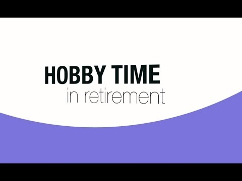

## Hi there 👋

 I am a pure product of the 1980s, programmed my [MSX](https://www.msx.org/wiki/Philips_NMS_8280) in its [Z80A](https://www.msx.org/wiki/Z80A) assembly as far away as my native French backyard as Zandvoort Nederland.  

 Good times: coding on projects never done before (ex: realtime software decoding of Canal+ 's [RITC Discret 11 encryption](https://en.wikipedia.org/wiki/Television_encryption#RITC_Discret_11)), bicycling accross frontiers to meet 'colleagues' for grander projects.  
 

 I think I squeezed everything out of my legendary Philips NMS-8280 and maybe I did not give it all to its successor, the [Turbo-R](https://www.msx.org/wiki/Panasonic_FS-A1GT) after the MSX was abandonned.  

 I kept a love for getting as much out of any hardware I put my hands on, from the TI C5402 I programemd in C at the beginning of my International career (first job in the US) , via rpi3B to my qualcomm Copilot+ laptop. I was lucky to work on projects bringing billions in earnings for the Energy sector. It all culminated in me bringging the first CI/CD to the embedded community of our US locations, some orchestration in C++ (how dare you ?). Good times.
 
 This last part really raised my awareness on using modern tools and practices to code ever faster, when I experienced the fastest deployment to prod in the history of our code, near flawless (needed resizing of the heap). Ever since, I am turning my attention more and more to the dev experience. Our CEO wants 10x impact.

  
\<tangent>  
 I went in search of dev friendly tech, with the hope to bring it back to my embedded origins. I have dreamt of bringing reactiveX to C, even if done with templating (see my quick [POC of t_rx](https://github.com/sramshaw/t_rx)). I was targetting the [parallela SBC](https://www.adapteva.com/parallella/) at the time with its 32kB per core.
 I stopped when I did not find a good platform for extending the C language (by using new features like lambdas) into a DSL for C like languages, to generate the code needed. Maybe later on a language friendlier to expansion. I am not interested in a full Rx with backpressure, but rather a simple fluent syntax allowing flat_map and handling of incoming interrupts and corresponding data. A simple forever loop could service progress for the async code. The memory required for each flat_map sub-sequence would be reserved on the stack, no heap.

 IIRC I got it down to 5KB compiled for a simple example ...   
 \</tangent for="now">

 There are other technos really coming into the embedded scope. I used to look into Embedded Linux and [how to simplify the user experience](https://github.com/sramshaw/bbbb) based on audits I conducted. It could have been the next necessary source of relief in the embedded world, but I have faced the pushback from teams not willing to put docker on a beaglebone. It was already a stretch to put linux it seems.  
 Now with small chips now having NPU and TPU rather than GBs of RAM, and the disparate tooling by chip manufacturers, it is still hard to see a good dev experience without eclipse etc...
 At this time I am looking for solutions that can run in vscode, my daily driver, using OSS toolchains and provide added value like docker would.

  
 Enters WASM ....
 Ok, not for the 32KB, but for the teams I mentioned above, assuming good perfs!
 To Be Continued... 
 
 I will endeavor to make some of those things more approachable, and fit more goodies within the boundaries of our modest hardware.

<!--
**sramshaw/sramshaw** is a ✨ _special_ ✨ repository because its `README.md` (this file) appears on your GitHub profile.

Here are some ideas to get you started:

- 🔭 I’m currently working on ...
- 🌱 I’m currently learning ...
- 👯 I’m looking to collaborate on ...
- 🤔 I’m looking for help with ...
- 💬 Ask me about ...
- 📫 How to reach me: ...
- 😄 Pronouns: ...
- ⚡ Fun fact: ...
-->
